# Technical Interview Task: Embeddable AI Customer Support Widget - Work Done

This document details the completed work for the Embeddable AI Customer Support Widget, addressing each core requirement and consideration outlined in the "Technical Interview Task" document.

## Loom Demo Videos

- [Demo Video 1](https://www.loom.com/share/043d8422b38e4b658230b7011a29049f?sid=ece64777-9ed4-428a-9ffc-d4fe0af53c29)
- [Demo Video 2](https://www.loom.com/share/01cc62d68faf4057a997bf4e0c34ff46?sid=5fa53dbc-3f7d-433f-8647-e1321d5382b2)
- [Demo Video 3](https://www.loom.com/share/503870836f474ad9aecf4e06ff4b425a?sid=4668a988-bef3-4f45-a152-3be41908198d)
- [Demo Video 4](https://www.loom.com/share/74b407385e2b40e282fea9176f37d496?sid=3ce0fdf5-d610-4bfb-b338-130f692a596e)

## Setup Project

### Backend Setup

1. Use uv to install dependencies(`uv sync`) and set up the backend.
2. Set up a PostgreSQL DB instance.
3. Fill out environment variables based on .env.example. Key variables include:

```
MODEL_API_KEY=your_gemini_api_key
MODEL_NAME=gemini-2.5-flash
DB_USER=...
DB_PASSWORD=...
SECRET_KEY=your_jwt_secret
```

Then finally run `python3 app.py`, it will create the table automatically and run the server.

`uvicorn app:app --host 0.0.0.0 --port 8000 --reload` command for live debugging

### Running Tests

```bash
cd Backend
uv run pytest tests/ -v -s
```

Tests are organized by module (chatbot, auth, ingestion, stats, ticket, health) using JSON-driven parametrized cases. External LLM tests are tagged `@pytest.mark.external` and can be skipped by default.

### Frontend Setup

1. Open index.html from the Frontend folder in your browser.
2. Ensure the environment configuration is set in the embedded script:

window.ChatbotWidgetConfig = {
  backendBaseUrl: "http://localhost:8000",
  title: "Embedded Chatbot",
  hostUrl: "https://company-website.com",
  hostDescription: "Short description of company",
  ...
};

You will need service credentials for Email JS, Google OAuth etc(As mine are private), Provided are the links to get them:

1. Email JS(Email Client): https://dashboard.emailjs.com
2. Google OAuth(Authentication): https://developers.google.com/identity/protocols/oauth2
3. Gemini API Key(Chatbot Response Generation on Scale): https://ai.google.dev/gemini-api/docs/api-key
4. Sentry(Issue + Error Tracking): https://sentry.io After creating account + project, goto "Project -> settings -> Client Keys" to get the DSN key.
5. PineCone(VectorDB): https://www.pinecone.io
6. FireCrawl(AI Powered Web Scrapping): https://www.firecrawl.dev/
7. VoyageAI(Embedding Model): https://www.voyageai.com/
8. Calendly: Get the your scheduled meeting post URL
9. DeepSeek Model(Good For Information Extraction, Reasoning + Cost): https://platform.deepseek.com

Then open the frontend by copy pasting the index.html file path into the browser e.g  "/Embeddable-AI-Customer-Support-Widget/Frontend/index.html"
That’s it — the chatbot should be up and running on your local machine.

## 1. Embeddable Widget

**Requirements Met:**

- **Create a lightweight, embeddable JavaScript widget that works across different platforms:** Fulfilled. The widget is integrated using a simple script tag, making it embeddable across various platforms like Wix, WordPress, and Next.js.
- **Should be easily integrated with a simple script tag or component:** Fulfilled. Integration is achieved by including a `<script>` tag with `window.ChatbotWidgetConfig` for configuration.
- **Responsive design that works on mobile and desktop:** Fulfilled. The chatbot is described as highly professional and responsive to all screen sizes.
- **Customizable styling to match different websites:** Fulfilled. Styling (colors), title, backend URL, and other parameters are customizable through the `ChatbotWidgetConfig` object in the script tag.
- **Minimal impact on host website performance:** Implicitly addressed by using a lightweight JavaScript approach and scoped CSS.

**Demo**

    `<script>`
      window.ChatbotWidgetConfig = {
        colors: {
          primary: "#009688",
          primaryDark: "#00695c",
          accent: "#b2dfdb",
        },
        // Email Configuration
        emailJsUserId: "",
        emailJsServiceId: "",
        emailJsSupportTemplateId: "",
        emailJsUserTemplateId: "",
        // Title of Chatbot
        title: "Embedded Chatbot",
        // Backend URL for our service
        backendBaseUrl: "http://localhost:8000",
        // Google Authentication
        googleClientId: "",
        // Target Company Data
        hostUrl: "https://crumblcookies.com/",
        hostDescription: "Crumbl Cookies is a cookie company that sells cookies",
        calendlyUrl: "",
      };
    `</script>`

**Implementation Details:**

- The chatbot uses scoped CSS, ensuring that its styling only affects the parent-defined root div and avoids conflicts with the host website's CSS.

## 2. AI Chat Interface

**Requirements Met:**

- **Real-time chat interface with the AI:** Fulfilled. The chatbot provides a real-time streaming chat experience via Server-Sent Events (SSE) with a typewriter animation effect.
- **AI should provide contextual responses about the company/website:** Fulfilled. Pinecone VectorDB to index specialized data, FireCrawl scrapes the provided URLs and then are indexed by PineCone to provide accurate context. The AI (Google Gemini 2.5 Flash with Google Search support) uses the provided `hostUrl` and `hostDescription` to gather real-time information about the company for contextual responses.
- **Support for rich responses (buttons, forms, calendar pickers):** Fulfilled. The chatbot supports in-built calendar (Calendly scheduling) and forms (human handoff), and has some support for Markdown.
- **Chat history within the session:** Fulfilled. Chat history within the session is retained and stored as proper JSON in the database.
- **Professional, clean UI/UX:** Fulfilled. The chatbot is described as highly professional and responsive

**Demo Screenshots:**

<table style="width: 100%; height: 50%;">
  <tr>
    <td>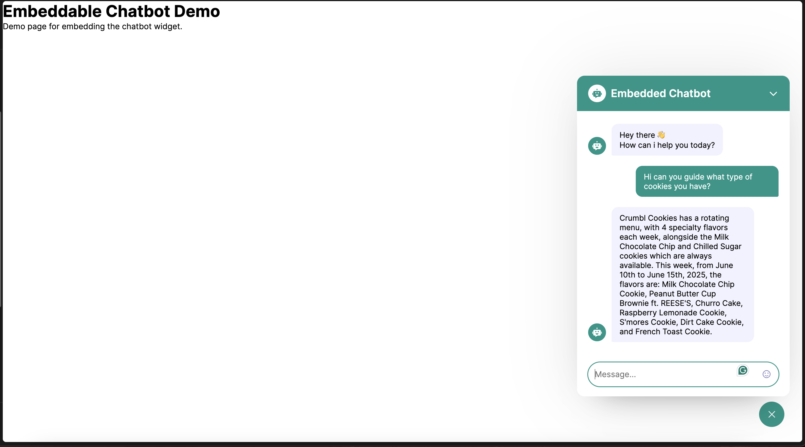 Desktop View</td>
    <td>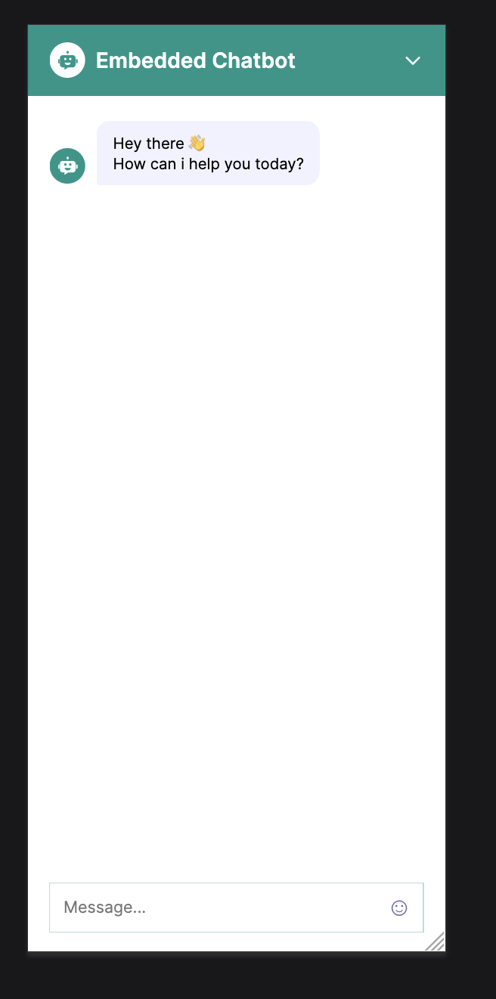Mobile View</td>
  </tr>
</table>

**Implementation Details:**

- All user sessions and their chat histories are stored in the backend database as valid JSON (`json.dumps()`).
- The chatbot uses a **two-phase SSE streaming architecture**:
  - **Phase 1 (Intent Classification):** A lightweight Gemini call classifies the user's intent as `regular`, `booking`, or `handoff` (~200-500ms).
  - **Phase 2 (Conditional Response):** For regular intents, text tokens are streamed via Gemini `streamGenerateContent`. Booking and handoff intents emit structured action events.
- The frontend consumes SSE events via `fetch` + `ReadableStream` and renders text with a character-by-character typewriter animation.

## 3. Action 1: Google Calendar Integration (Required)

**Requirements Met:**

- **Connect to Google Calendar API to pull real-time availability:** Fulfilled, but with a strategic alternative. Instead of directly integrating with Google Calendar API, Calendly's iFrame solution was chosen, which inherently handles real-time availability.
- **Display available time slots to users in a user-friendly format:** Fulfilled by Calendly's iFrame, which provides a visual calendar for selecting days
- **Allow users to book appointments directly through the widget:** Fulfilled by Calendly's iFrame integration
- **Create calendar events with Google Meet links automatically:** Fulfilled by Calendly's functionality.
- **Send confirmation emails with calendar invites:** Fulfilled by Calendly's functionality
- **Handle timezone conversions properly:** Fulfilled by Calendly's built-in timezone management.

**Demo Screenshots:**

<!-- BEGIN COLLAGE 1 -->

<table>
  <tr>
    <td>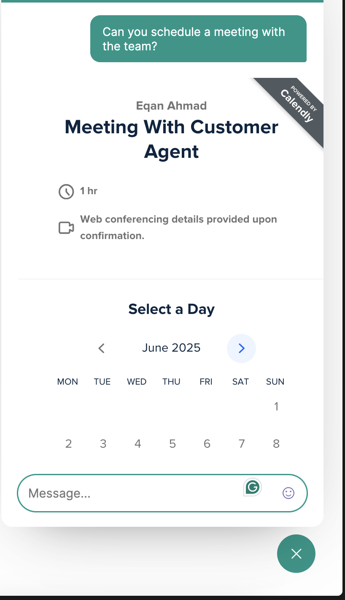</td>
    <td>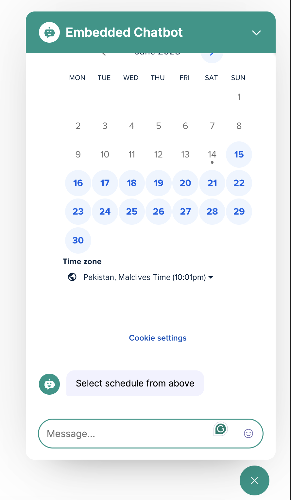</td>
    <td>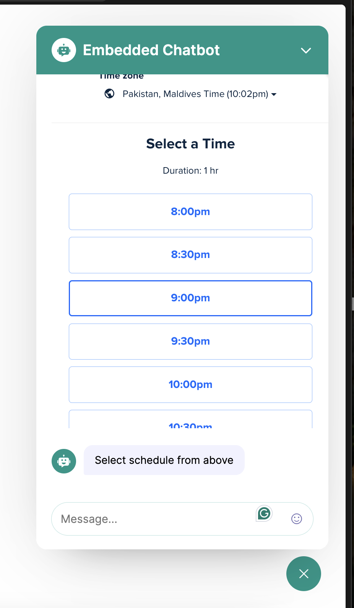</td>
    <td>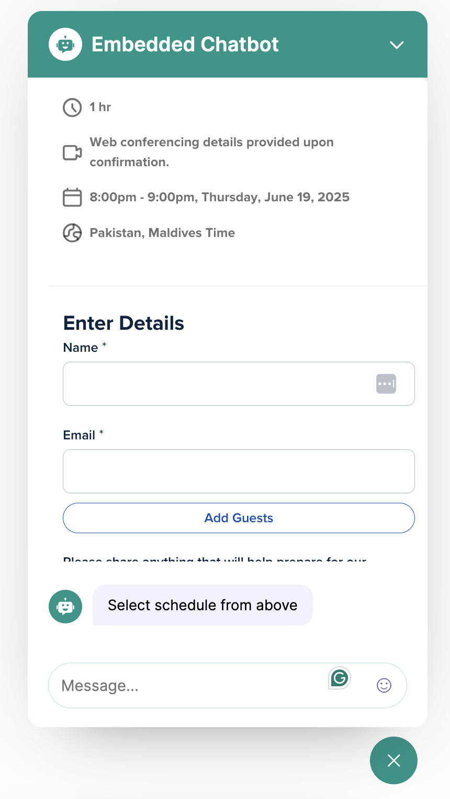</td>
  </tr>
</table>
<!-- END COLLAGE 1 -->

**Implementation Details:**

- Calendly was chosen as a ready-to-use solution via an iFrame, eliminating the need to build Google Calendar API integrations from scratch and leveraging Calendly's proven user experience and features.
- Appointment rescheduling and slot availability management are handled directly from the Calendly website.

## 4. Action 2: Human Handoff (Required)

**Requirements Met:**

- **When user requests to talk to a human, show a form to collect:**

  - Name (required)
  - Email (required)
  - Phone (optional)
  - Message/Issue description (required)
  - Priority level (Low/Medium/High/Urgent)
  - **All form requirements are met within the application.**
- **Send email notification to support team with form details:** Fulfilled using EmailJS.
- **Send auto-confirmation email to the user:** Fulfilled using EmailJS.
- **Generate a support ticket ID for tracking:** Fulfilled. A support ticket ID is generated for tracking, as shown in the email example and all support tickets along with their status(Open|Closed|Inprogress) saved in the database for tracking.

**Demo Screenshots:**

<!-- BEGIN COLLAGE 2 -->

<table>
  <tr>
    <td>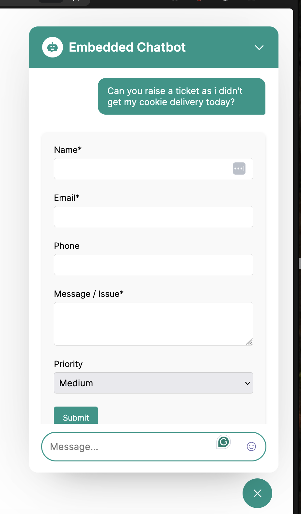</td>
    <td>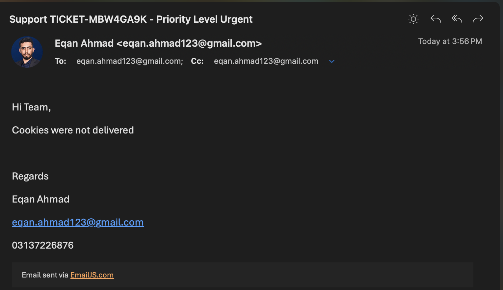</td>
  </tr>
</table>
<!-- END COLLAGE 2 -->

**Implementation Details:**

- A user issue tracking system is built into the backend to conveniently manage user issues.
- EmailJS is used for sending email notifications to the support team and auto-confirmations to the user.

## 5. Interaction Logging (Required)

**Requirements Met:**

- **Log all conversations to Supabase|Postgres database:** Fulfilled. All user sessions and messages are stored in the backend databases.
- **Track user sessions, messages, and actions taken:** Fulfilled. Stored sessions include information regarding bookings and human handoff forms.
- **Store metadata like timestamps, user info, conversation outcomes:** Fulfilled. This information is part of the stored sessions.
- **Basic analytics on conversation volume and success rates:** Fulfilled. Information is processed daily via a cron job to get the volume of conversations and success rates and furthermore using sentry to track all API bugs, errors etc in real time

**Demo Screenshots:**

<table>
  <tr>
    <td>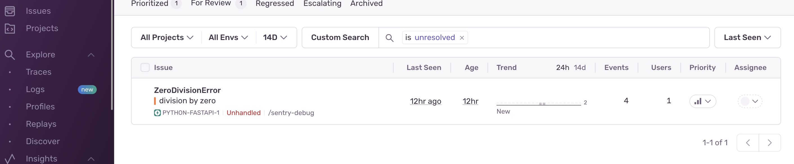Sentry</td>
    <td>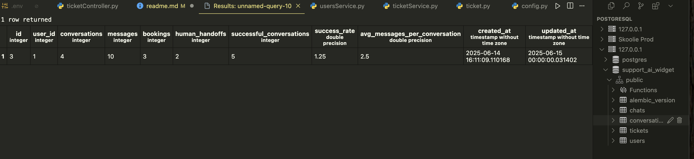Analytics</td>
  </tr>
</table>

**Implementation Details:**

- PostgreSQL is the chosen database for logging interactions in local development but Supabase provides instance of PostgreSQL in production so wouldn't be an issue. Furthermore Sentry is chosen for error and issues logging of the APIs.

## Technical Stack

**Backend:**

- **Framework:** FastAPI (Python), async endpoints with `aiohttp` for non-blocking LLM calls.
- **Database:** PostgreSQL (SQLAlchemy ORM with `scoped_session` for thread-safe, per-request sessions), Alembic for migrations.
- **LLM:** Google Gemini 2.5 Flash (via Google AI Studio API, with Google Search grounding enabled), DeepSeek (for ingestion/reasoning).
- **Streaming:** Server-Sent Events (SSE) via `StreamingResponse` with two-phase architecture (intent classification + conditional streaming).
- **Vector Search:** Pinecone VectorDB for RAG, Voyage AI embeddings (`voyage-3`).
- **Scraping:** Firecrawl AI for website content extraction.
- **Auth:** Google OAuth + JWT tokens via `Authorization: Bearer` header, `pyjwt` for encode/decode.
- **Config:** Pydantic `BaseSettings` for validated, type-coerced environment variables (single centralized instance).
- **Monitoring:** Sentry (error tracking), SlowAPI (rate limiting).
- **Testing:** pytest with JSON-driven parametrized test cases, custom assertion helpers, SSE stream assertions. ~90 test cases across 6 modules.
- **Other:** APScheduler (background stats cron), Ruff (linting).

**Frontend:**

- **Widget:** Vanilla JS (single embeddable IIFE).
- **Styling:** Scoped CSS with typewriter animation (blinking cursor).
- **SSE Consumer:** `fetch` + `ReadableStream` for streaming chat responses.
- **Other:** EmailJS, Calendly (iFrame), Google Identity Services, Markdown parser, Emoji Picker.

## Architecture Considerations for Future

- **Appointment Rescheduling:** Already handled by Calendly, which offers API support for this.
- **Internal Database Queries:** Easily attachable using SQL Alchemy ORM with Alembic migrations or via API calls. Pinecone VectorDB attached for vector stores/Large Knowledge base.
- **Live Agent Handoff:** A flag or quick email notification to a human agent, with a real-time websocket connection if availability is confirmed, can facilitate seamless transition.
- **Multi-language Support:** Easily done with the prompt.
- **Advanced Analytics:** Basic analytics are implemented, with potential for improvement on the analytics module or integration with tools like Google Analytics. Sentry  also used for advanced issue related analytics.

**Overall Architecture:**

- The backend infrastructure is built on a "screaming architecture," emphasizing modularity and ease of modification. Furthermore OOP(Object Oriented Programming) is being utilized for service modules which can allow us for easy import of modules in other services and Functional Programming for REST APIs.
- The chatbot is designed to be highly modular, allowing most changes to be handled by adjusting frontend parameters, with the backend automatically adapting.
- Thread-safe database access via SQLAlchemy `scoped_session` — each request gets its own isolated session, preventing stale reads and transaction leaks.
- Two-phase SSE streaming for the chatbot: a lightweight intent classification call followed by conditional streaming (text tokens for regular queries, structured action events for booking/handoff).
- Centralized configuration through a single Pydantic `BaseSettings` instance with proper validation and type coercion.

## Deliverables

- **Widget Implementation:**

  - Embeddable JavaScript file: Provided through the script tag integration.
  - Demo HTML page: Implied by the integration instructions.
  - Basic customization options: Covered by the `ChatbotWidgetConfig`.
- **Backend API:**

  - RESTful API endpoints for chat, calendar, and support requests: Implemented with FastAPI.
  - SSE streaming endpoint (`POST /chatbot-response/stream`) for real-time response delivery.
  - Google Calendar integration for availability and booking: Fulfilled through Calendly integration.
  - Email notification system for support requests: Implemented using EmailJS.
  - Database operations for logging interactions: Handled with PostgreSQL, Pinecone and Sentry.
  - Web Scraping: Handled by Firecrawl AI.
- **Database Setup:**

  - PostgreSQL Native project with proper tables for conversations, bookings, and support requests: Implemented except for bookings as Calendly is handling it automatically.
  - Vector embeddings setup for AI context: Pinecone VectorDB (Large Knowledge Base) + Google Search with Gemini 2.5 Flash (Short Real Time Knowledge Base)

  Creating a revision: `alembic revision -m "Description of the revision"`
  Upgrading To latest Postgres Migration: `alembic upgrade head`

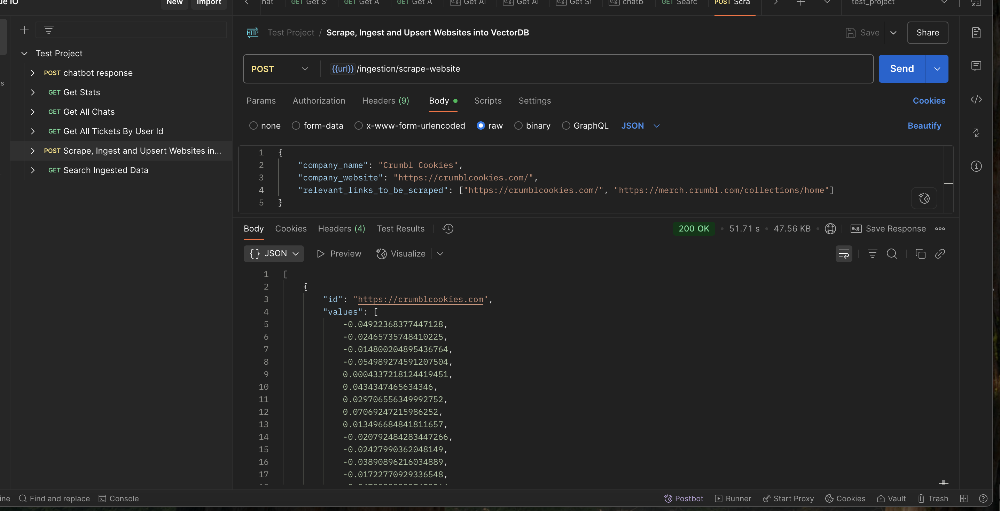

- **Documentation:**

  - Integration guide: Provided in the `script` tag example.
  - API documentation: Provided by FAST API[Use the FAST API interactive docs] and also in the commented code.

  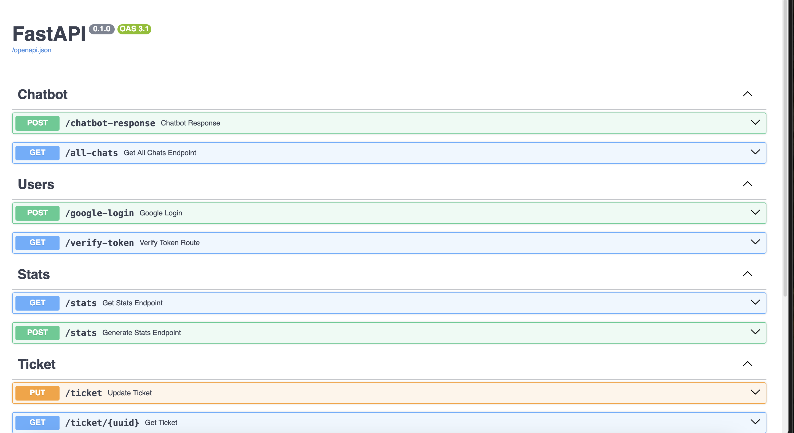

  <table>
      <tr>
        <td>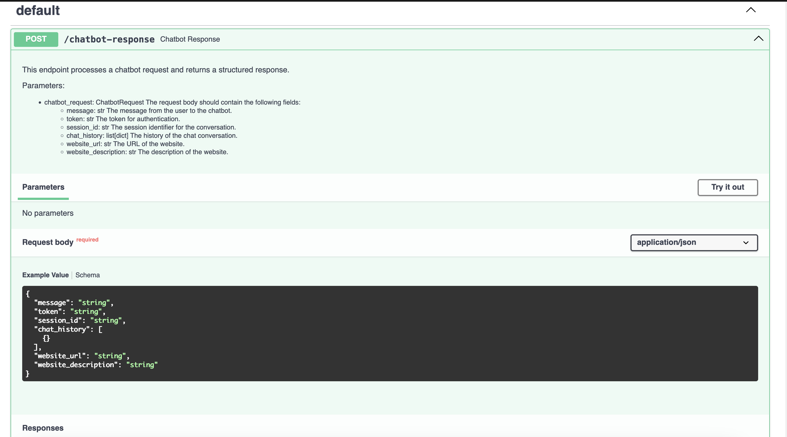</td>
        <td>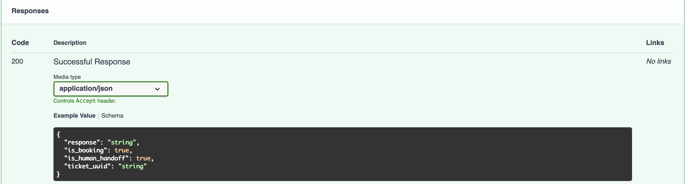</td>
      </tr>
    </table>
  - Setup instructions for Google Calendar and email services: Covered by the Calendly URL and EmailJS credentials in the configuration.

## Evaluation Criteria

- **Technical Implementation (40%):**

  - Clean, well-organized code: Implied by the "screaming architecture", OOP for services + Functional Programming and choice of frameworks (FastAPI, SQLAlchemy). Centralized configuration via Pydantic `BaseSettings`.
  - Proper error handling: Sentry is installed in the backend for real-time system failure updates and bug tracking. Proper HTTP status codes (401 for auth failures, 422 for validation).
  - Security best practices: Google OAuth, JWT via `Authorization: Bearer` header (not request body), rate limiting, CORS configuration, and payload limits are implemented.
  - Testing: Comprehensive pytest suite with ~90 test cases covering validation, auth, response schemas, SSE streaming, and payload limits.
  - Widget integration works smoothly: Confirmed by the description of the embeddable and customizable widget
- **Feature Completeness (40%):**

  - Google Calendar integration works correctly: Fulfilled via Calendly.
  - Human handoff form and email system functions properly: Fulfilled using EmailJS and the in-built issue tracking.
  - entry.
  - AI provides relevant responses: Fulfilled by PineCone VectorDB and Gemini 2.5 Flash with Google Search capabilities.
- **User Experience (20%):**

  - Intuitive and responsive interface: Confirmed by the description and provided screenshots
  - Smooth booking and handoff flows: Demonstrated by the Calendly integration and human handoff form process.
  - Professional appearance and behavior: Confirmed by the description and visual evidence.
  - Good documentation for integration: Provided through the script tag example.

## Questions to Consider

1. **How will you handle widget styling conflicts with host websites?**

   - Handled by using scoped CSS, where the parent-defined div is considered the root, ensuring only its particular CSS is modified.
2. **What happens when Google Calendar API is unavailable?**

   - Not directly applicable as Calendly is used. Calendly's service availability would be the concern, and it's a robust, proven solution.
3. **How will you manage conversation context for the AI?**

   - Chat history within the session is retained as valid JSON. The AI leverages Google Gemini 2.5 Flash with Google Search grounding and is provided with `hostUrl` and `hostDescription` for real-time contextual information. Responses are streamed via SSE with a two-phase architecture (intent classification + conditional streaming). Alongside we are using Pinecone VectorDB to get specialized indexed data.
4. **What security measures will you implement?**

   - Google OAuth, JWT tokens via standard `Authorization: Bearer` header (proper OAuth2 convention), rate limiting for API calls, CORS configuration, and payload limits are implemented. Sentry is also used for real-time system failure updates and bug tracking.
5. **How will you handle different timezones for calendar bookings?**

   - Handled inherently by Calendly's built-in functionality

## Future Considerations

Shifting Calendly and Email notification systems to backend via APIs for enhanced security, but need to find a way on how to automtically get calendly API key and email service credentials from the user. So we can stop people from getting their hands on even public API's and URLs.
