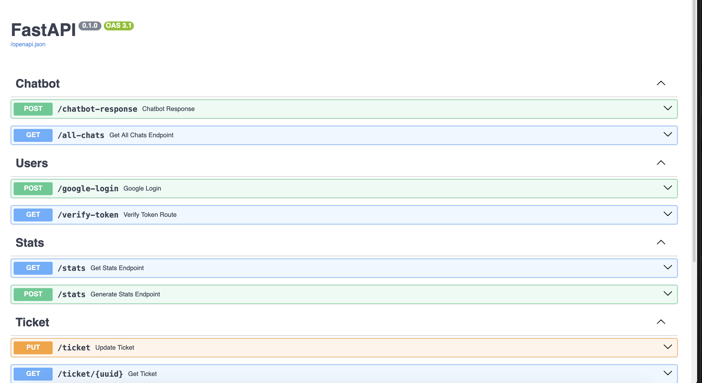

# Technical Interview Task: Embeddable AI Customer Support Widget - Work Done

This document details the completed work for the Embeddable AI Customer Support Widget, addressing each core requirement and consideration outlined in the "Technical Interview Task" document.

## 1. Embeddable Widget

**Requirements Met:**

- **Create a lightweight, embeddable JavaScript widget that works across different platforms:** Fulfilled. The widget is integrated using a simple script tag, making it embeddable across various platforms like Wix, WordPress, and Next.js.
- **Should be easily integrated with a simple script tag or component:** Fulfilled. Integration is achieved by including a ``

**Implementation Details:**

- The chatbot uses scoped CSS, ensuring that its styling only affects the parent-defined root div and avoids conflicts with the host website's CSS.

## 2. AI Chat Interface

**Requirements Met:**

- **Real-time chat interface with the AI:** Fulfilled. The chatbot provides a real-time chat experience.
- **AI should provide contextual responses about the company/website:** Fulfilled. The AI (Google Gemini Flash 2.0 with Google Search support) uses the provided `hostUrl` and `hostDescription` to gather real-time information about the company for contextual responses.
- **Support for rich responses (buttons, forms, calendar pickers):** Fulfilled. The chatbot supports in-built calendar (Calendly scheduling) and forms (human handoff), and has some support for Markdown.
- **Chat history within the session:** Fulfilled. Chat history within the session is retained.
- **Professional, clean UI/UX:** Fulfilled. The chatbot is described as highly professional and responsive

**Demo Screenshots:**

**Implementation Details:**

- All user sessions and their chat histories are stored in the backend database.

## 3. Action 1: Google Calendar Integration (Required)

**Requirements Met:**

- **Connect to Google Calendar API to pull real-time availability:** Fulfilled, but with a strategic alternative. Instead of directly integrating with Google Calendar API, Calendly's iFrame solution was chosen, which inherently handles real-time availability.
- **Display available time slots to users in a user-friendly format:** Fulfilled by Calendly's iFrame, which provides a visual calendar for selecting days
- **Allow users to book appointments directly through the widget:** Fulfilled by Calendly's iFrame integration
- **Create calendar events with Google Meet links automatically:** Fulfilled by Calendly's functionality.
- **Send confirmation emails with calendar invites:** Fulfilled by Calendly's functionality
- **Handle timezone conversions properly:** Fulfilled by Calendly's built-in timezone management.

**Demo Screenshots:**

<!-- BEGIN COLLAGE 1 -->

<table>
  <tr>
    <td></td>
    <td></td>
    <td></td>
    <td></td>
  </tr>
</table>
<!-- END COLLAGE 1 -->

**Implementation Details:**

- Calendly was chosen as a ready-to-use solution via an iFrame, eliminating the need to build Google Calendar API integrations from scratch and leveraging Calendly's proven user experience and features.
- Appointment rescheduling and slot availability management are handled directly from the Calendly website.

## 4. Action 2: Human Handoff (Required)

**Requirements Met:**

- **When user requests to talk to a human, show a form to collect:**

  - Name (required)
  - Email (required)
  - Phone (optional)
  - Message/Issue description (required)
  - Priority level (Low/Medium/High/Urgent)
  - **All form requirements are met within the application.**
- **Send email notification to support team with form details:** Fulfilled using EmailJS.
- **Send auto-confirmation email to the user:** Fulfilled using EmailJS.
- **Generate a support ticket ID for tracking:** Fulfilled. A support ticket ID is generated for tracking, as shown in the email example and all support tickets along with their status(Open|Closed|Inprogress) saved in the database for tracking.

**Demo Screenshots:**

<!-- BEGIN COLLAGE 2 -->

<table>
  <tr>
    <td></td>
    <td></td>
  </tr>
</table>
<!-- END COLLAGE 2 -->

**Implementation Details:**

- A user issue tracking system is built into the backend to conveniently manage user issues.
- EmailJS is used for sending email notifications to the support team and auto-confirmations to the user.

## 5. Interaction Logging (Required)

**Requirements Met:**

- **Log all conversations to Supabase|Postgres database:** Fulfilled. All user sessions and messages are stored in the backend databases.
- **Track user sessions, messages, and actions taken:** Fulfilled. Stored sessions include information regarding bookings and human handoff forms.
- **Store metadata like timestamps, user info, conversation outcomes:** Fulfilled. This information is part of the stored sessions.
- **Basic analytics on conversation volume and success rates:** Fulfilled. Information is processed daily via a cron job to get the volume of conversations and success rates and furthermore using sentry to track all API bugs, errors etc in real time

**Demo Screenshots:**

<table>
  <tr>
    <td></td>
    <td></td>
  </tr>
</table>

**Implementation Details:**

- PostgreSQL is the chosen database for logging interactions in local development but Supabase provides instance of PostgreSQL in production so wouldn't be an issue. Furthermore Sentry is chosen for error and issues logging of the APIs.

## Technical Stack Requirements

**Backend:**

- **Database:** PostgreSQL 14.
- **LLM:** Google Gemini Flash 2.0 (via OpenRouter API, with Google Search Support enabled).
- **APIs:** Email service (EmailJS[Used in Frontend]), Calendly (instead of Google Calendar API).
- **Framework:** FAST API with Python.
- **Other:** Alembic(Data Migrations), Sentry(Issues Logging), Rate Limiter, Google Authentication, Ruff(Python Linter), Pydantic(Typing Within Python), SQL Alchemy(ORM).

**Frontend:**

- **Widget:** Vanilla JS.
- **Styling:** Scoped CSS.
- **Build:** Bundling for easy distribution.
- **Other:** EmailJS, Calendly, Google Authentication, Markdown parser, Emoji Picker, HTML.

## Architecture Considerations for Future

- **Appointment Rescheduling:** Already handled by Calendly, which offers API support for this.
- **Internal Database Queries:** Easily attachable using SQL Alchemy ORM with Alembic migrations or via API calls.
- **Live Agent Handoff:** A flag or quick email notification to a human agent, with a real-time websocket connection if availability is confirmed, can facilitate seamless transition.
- **Multi-language Support:** Easily done with the prompt.
- **Advanced Analytics:** Basic analytics are implemented, with potential for improvement on the analytics module or integration with tools like Google Analytics. Sentry  also used for advanced issue related analytics.

**Overall Architecture:**

- The backend infrastructure is built on a "screaming architecture," emphasizing modularity and ease of modification. Furthermore OOP(Object Oriented Programming) is being utilized for service modules which can allow us for easy import of modules in other services and Functional Programming for REST APIs.
- The chatbot is designed to be highly modular, allowing most changes to be handled by adjusting frontend parameters, with the backend automatically adapting.

## Deliverables

- **Widget Implementation:**

  - Embeddable JavaScript file: Provided through the script tag integration.
  - Demo HTML page: Implied by the integration instructions.
  - Basic customization options: Covered by the `ChatbotWidgetConfig`.
- **Backend API:**

  - RESTful API endpoints for chat, calendar, and support requests: Implemented with FAST API.
  - Google Calendar integration for availability and booking: Fulfilled through Calendly integration
  - Email notification system for support requests: Implemented using EmailJS.
  - Database operations for logging interactions: Handled with Postgres and Sentry.
- **Database Setup:**

  - PostgreSQL Native project with proper tables for conversations, bookings, and support requests: Implemented except for bookings as Calendly is handling it automatically.
  - Vector embeddings setup for AI context: Not explicitly required or implemented based on the chosen AI context approach (Google Search with Gemini 2.0) which retrieves information automatically based on public information of the company(Website etc).
- **Documentation:**

  - Integration guide: Provided in the `script` tag example.
  - API documentation: Provided by FAST API[Use the FAST API interactive docs] and also in the commented code.

    <table>
      <tr>
        <td></td>
      </tr>
      <tr>
        <td></td>
        <td></td>
      </tr>
    </table>
  - Setup instructions for Google Calendar and email services: Covered by the Calendly URL and EmailJS credentials in the configuration.

## Evaluation Criteria

- **Technical Implementation (40%):**

  - Clean, well-organized code: Implied by the "screaming architecture", OOP for services + Functional Programming and choice of frameworks (FAST API, SQL Alchemy).
  - Proper error handling: Sentry is installed in the backend for real-time system failure updates and bug tracking.
  - Security best practices: Google OAuth, Rate limiting, CORS configuration, token-based authentication for requests, and payload limits are implemented.
  - Widget integration works smoothly: Confirmed by the description of the embeddable and customizable widget
- **Feature Completeness (40%):**

  - Google Calendar integration works correctly: Fulfilled via Calendly.
  - Human handoff form and email system functions properly: Fulfilled using EmailJS and the in-built issue tracking.
  - All interactions are logged to database: Fulfilled with PostgreSQL and Sentry.
  - AI provides relevant responses: Fulfilled by Gemini 2.0 with Google Search capabilities.
- **User Experience (20%):**

  - Intuitive and responsive interface: Confirmed by the description and provided screenshots
  - Smooth booking and handoff flows: Demonstrated by the Calendly integration and human handoff form process.
  - Professional appearance and behavior: Confirmed by the description and visual evidence.
  - Good documentation for integration: Provided through the script tag example.

## Questions to Consider

1. **How will you handle widget styling conflicts with host websites?**

   - Handled by using scoped CSS, where the parent-defined div is considered the root, ensuring only its particular CSS is modified.
2. **What happens when Google Calendar API is unavailable?**

   - Not directly applicable as Calendly is used. Calendly's service availability would be the concern, and it's a robust, proven solution.
3. **How will you manage conversation context for the AI?**

   - Chat history within the session is retained. The AI leverages Google Gemini Flash 2.0 with Google Search support and is provided with `hostUrl` and `hostDescription` for real-time contextual information.
4. **What security measures will you implement?**

   - Google OAuthentication, Rate limiting for API calls, CORS configuration, token-based authentication for requests, and payload limits are implemented. Sentry is also used for real-time system failure updates and bug tracking.
5. **How will you handle different timezones for calendar bookings?**

   - Handled inherently by Calendly's built-in functionality

## Future Considerations

Shifting Calendly and Emai notification systems to backend via APIs for enhanced security, but need to find a way on how to automtically get calendly API key and email service credentials from the user. So we can stop people from getting their hands on even public API's and URLs.
